# ChainWatch Application Architecture

## High-Level Architecture


## Detailed Data Flow

```mermaid
sequenceDiagram
    participant User as 👤 User
    participant UI as 🖥️ Frontend (Next.js)
    participant API as 🚀 FastAPI Backend
    participant Orch as 🎯 Orchestrator
    participant State as 💾 State Store
    participant Agents as 🤖 Agents
    participant LLM as 🧠 LLM Service
    participant ExtAPI as 🌐 External APIs

    User->>UI: Select Region & Click Analyze
    UI->>API: POST /analyze/{region}
    API->>Orch: analyze(region)

    Orch->>State: Initialize SystemState
    Orch->>Agents: NewsAgent.run(region)
    Agents->>ExtAPI: Fetch news articles
    ExtAPI-->>Agents: News data
    Agents->>LLM: classify_news_risk(articles)
    LLM-->>Agents: Risk classification
    Agents-->>Orch: News risk result

    Orch->>Agents: WeatherAgent.run(region)
    Agents->>ExtAPI: Fetch weather data
    ExtAPI-->>Agents: Weather data
    Agents-->>Orch: Weather risk result

    Orch->>Agents: PortAgent.run(region)
    Agents->>LLM: Analyze port conditions
    LLM-->>Agents: Port risk result
    Agents-->>Orch: Port risk result

    Orch->>Agents: AggregationAgent.run()
    Agents-->>Orch: Aggregated risk score

    Orch->>Agents: ExplanationAgent.run()
    Agents->>LLM: generate_explanation()
    LLM-->>Agents: Plain-text explanation
    Agents-->>Orch: Explanation

    Orch->>State: Update with all results
    State-->>Orch: Confirmation
    Orch-->>API: Complete SystemState
    API-->>UI: SystemState response
    UI->>User: Display risk dashboard

    Note over User,UI: User can now ask questions
    User->>UI: Ask question in chat
    UI->>API: POST /chat
    API->>State: Get current state
    State-->>API: SystemState
    API->>LLM: answer_chat_question()
    LLM-->>API: AI response
    API-->>UI: Chat response
    UI->>User: Display answer
```



## Component Architecture

```mermaid
graph TB
    subgraph "Frontend Components"
        Dashboard[Dashboard Page]
        Header[Header Component]
        RegionSelector[Region Selector]
        AnalyzeButton[Analyze Button]
        RiskMeter[Risk Meter]
        RiskCards[Risk Cards]
        ChatBot[Chat Bot]
        EmptyState[Empty State]
        BackgroundEffects[Background Effects]
    end

    subgraph "API Endpoints"
        Health[GET /health]
        Regions[GET /regions]
        Analyze[POST /analyze/{region}]
        GetState[GET /state]
        StateSummary[GET /state/summary]
        Chat[POST /chat]
    end

    subgraph "Backend Modules"
        Config[config.py]
        State[state.py]
        Schemas[models/schemas.py]
    end

    Dashboard --> Header
    Dashboard --> RegionSelector
    Dashboard --> AnalyzeButton
    Dashboard --> RiskMeter
    Dashboard --> RiskCards
    Dashboard --> ChatBot
    Dashboard --> EmptyState
    Dashboard --> BackgroundEffects

    AnalyzeButton --> Analyze
    RegionSelector --> Regions
    RiskMeter --> GetState
    RiskCards --> GetState
    ChatBot --> Chat

    Analyze --> Config
    GetState --> State
    Chat --> State
    Analyze --> Schemas
    GetState --> Schemas
    Chat --> Schemas

    style Dashboard fill:#e3f2fd
    style Analyze fill:#fff3e0
    style Chat fill:#f3e5f5
```

## Agent Architecture


## Service Architecture


## State Management Flow


## Technology Stack


## Risk Assessment Pipeline


## API Request/Response Flow


## Key Architecture Patterns

1. **Orchestrator Pattern**: Central coordinator manages multiple specialized agents
2. **Agent Pattern**: Each risk type has a dedicated agent with single responsibility
3. **Service Layer**: External API integrations abstracted into service classes
4. **State Management**: Global state store for sharing analysis results
5. **RESTful API**: Clean separation between frontend and backend
6. **Component-Based UI**: Modular React components for maintainability
7. **Async/Await**: Non-blocking operations for better performance
8. **Dependency Injection**: Services injected into agents and orchestrator
